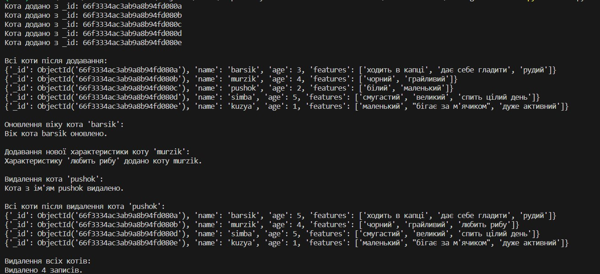

# Mongo Cats CRUD

Цей проєкт представляє собою простий Python скрипт, який реалізує основні CRUD (Create, Read, Update, Delete) операції з використанням MongoDB через бібліотеку PyMongo. В базі даних зберігається інформація про котів: ім'я, вік та їх характеристики.

## Вимоги

Для запуску проєкту необхідно встановити такі залежності (див. `requirements.txt`):

- Python 3.x
- MongoDB (локально або через MongoDB Atlas)
- Бібліотека PyMongo

## Структура документа

Документи в колекції мають таку структуру:

```json
{
    "_id": ObjectId("60d24b783733b1ae668d4a77"),
    "name": "barsik",
    "age": 3,
    "features": ["ходить в капці", "дає себе гладити", "рудий"]
}
```

## Функціонал

Скрипт дозволяє виконувати наступні операції:

Створення нового запису про кота
Виведення всіх записів
Виведення запису про конкретного кота за ім'ям
Оновлення віку кота
Додавання нових характеристик до запису про кота
Видалення запису за ім'ям кота
Видалення всіх записів з колекції
Використання

1. Клонування репозиторію
    ```bash
    git clone https://github.com/username/mongo-cats-crud.git
    cd mongo-cats-crud
    ```

2. Встановлення залежностей

У віртуальному середовищі Python встановіть залежності:

    ```bash
    pip install -r requirements.txt
    ```

3. Запуск MongoDB

Якщо у вас немає MongoDB, ви можете запустити його через Docker:
    ```bash
    docker run --name mongo-container -d -p 27017:27017 mongo
    ```

Або підключитися до MongoDB Atlas.

4. Запуск скрипта
    ```bash
    python main.py
    ```

5. Результат виконання скрипта

